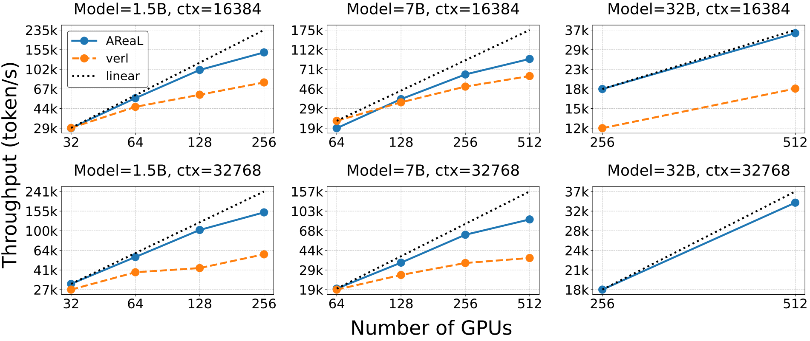

## Benchmark Results

We measure *effective training throughput*, defined as the number of tokens used in each RL training step divided by the time of that step. Note that since AReaL is asynchronous, some generated tokens may not be consumed by the trainer. We do not count these tokens in the throughput calculation.

We compare against the latest release of verl (v0.3.0.post1) as of May 7, 2025.



## How to Reproduce

Run `build_cmd.py` to generate the CLI command to run AReaL:

```bash
python3 benchmark/verl_v0_3_1_312a8cb/build_cmd.py --model-size 1 --ctx 32768 --n-nodes 4
```

The above command generates the command to run AReaL with `DeepSeek-R1-Distill-Qwen-1.5B` using 32k context length (31k generation length) on 4 nodes (32 GPUs). You can choose `model_size` from [1, 7, 32] and `n_nodes` from [4, 8, 16, 32, 64].

The throughput value can be parsed from the log (you should manually divide the number of tokens by the time):

```bash
# obtain the time
grep -ai "execution time" /path/to/main.log
# obtain the number of processed tokens
grep -ai "n_tokens" /path/to/main.log
```

Alternatively, these metrics can be found in wandb and tensorboard logs, named "time_perf/e2e" and "ppo_actor/n_tokens" respectively.

## Settings

The key settings include:

+ **Batch size**: 512 prompts with 16 answers each, following DAPO and VAPO.
+ **Maximum Generation Length**: 31k (32k context length minus 1k prompt length).
+ **Minimum Generation Length**: 0. This should not be set to the maximum length because the generation length varies for each prompt.
+ **Model**: Distilled models from DeepSeek-R1, which have long-CoT reasoning abilities. These *cannot* be simply replaced with models like Qwen2-7B, Qwen2.5-Math-7B, or randomly initialized weights.
+ **Dataset**: Our [math dataset](https://huggingface.co/datasets/inclusionAI/AReaL-boba-Data) or other similar open-source datasets. The prompts should trigger the model to generate a long-CoT trajectory.
