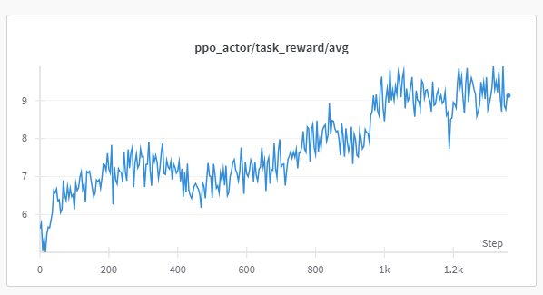

# Rollout and Agentic RL

This guide provides an example of modifying the rollout behavior for PPO training.

In particular, we implement a multi-turn math agent using end-to-end RL. The math agent will continuously attempt to think through and solve math problems until it reaches the correct answer.

## Define Your Agent

Create a new file under `realhf/impl/agent/`, for example, `math_multi_turn_agent.py`. Your `Agent` must implement the interface defined in `realhf/api/core/agent.py`, which requires implementing a single method: `collect_trajectory`.

```python
class MathMultiTurnAgent(Agent):
    
    async def collect_trajectory(
        self,
        prompt: SequenceSample,
        env: EnvironmentService,
        obs_queue: asyncio.Queue,
        act_queue: asyncio.Queue,
    ):
        ...
```

## Implement the `collect_trajectory` Logic

The `collect_trajectory` function takes a task prompt, an environment, and two queues as input, then produces several trajectories for the RL trainer. Within this function, you can create arbitrary data processing logic to produce the input for the inference engine (i.e., via `obs_queue`) and extract the action (i.e., via `act_queue`) from the generated tokens.

In this example, the initial observation is the math problem itself. We put the token IDs and generation config into `obs_queue` and wait for the action produced by the inference engine from `act_queue`. After the inference engine returns, we extract the generated answers and send them to the environment.

```python
for turn in range(self.num_turns):
    await obs_queue.put((qid, token_ids, self.gconfig))
    act: BundledGenerationOutputs = await act_queue.get()
    _, success, *_ = await env.step((qid, answers))
    ...
```

The environment is similar to a [gym environment](https://github.com/Farama-Foundation/Gymnasium), which defines two methods: `reset` and `step`. However, to maintain efficiency, we use an asynchronous implementation to avoid mutual blocking across different environment instances.

The math environment is stateless and essentially serves as a wrapper around the reward function:

```python
class MathCodeSingleStepEnv(EnvironmentService):

    async def step(self, action: Tuple[str, List[str]]):
        qid, answers = action
        ...
        # Make `math_verify_call` async
        format_rewards = await asyncio.to_thread(
            math_verify_call,
            answers,
            ...
        )
        return None, format_rewards, True, False, {}
```

After `env.step` returns the reward for the current step, we can check whether the answer is correct. If not, we can append a user prompt and send it to `obs_queue` again to enter the next round.

```python
for turn in range(self.num_turns):
    ...
    feedback = None
    if success[0]:
        feedback = "Congratulations! You are correct!"
    else:
        feedback = "Unfortunately your answer is wrong. Let's try again."
    
    feedback = "\n" + self.tokenizer.apply_chat_template(
        [dict(content=feedback, role="user")],
        add_generation_prompt=True,
        tokenize=False,
    )
    feedback = self.tokenizer(feedback)["input_ids"]
    token_ids.extend(feedback)
```

## Modify the Configuration

You're now close to running the end-to-end RL loop. The final step is to register and import your implementation, then modify the experiment configuration.

```python
# in realhf/impl/agent/math_multi_turn_agent.py
register_agent("math-multi-turn", MathMultiTurnAgent)
```

```python
# in realhf/impl/agent/__init__.py
import realhf.impl.agent.math_multi_turn_agent
```

In `realhf/experiments/async_exp/async_math_ppo.py`:

```diff
@dataclasses.dataclass
class AsyncPPOMATHConfig(AsyncRLExperimentConfig, PPOMATHConfig):
+   # New CLI arguments are defined here
+   my_param: float = 1.0

    # in realhf/experiments/async_exp/async_ppo_math_exp.py
    @property
    def agent(self) -> AgentAbstraction:
        return AgentAbstraction(
-           "math-single-step",
+           "math-multi-turn",  # Your registered name
            args=dict(
-                ...
+                # Any configurations for your __init__ method
+                my_param=my_param,
            ),
        )

    @property
    def env(self) -> EnvServiceAbstraction:
-        return EnvServiceAbstraction(
-            "math-code-single-step", args=dict(dataset_path=self.dataset.path)
-        )
+        # Change to your customized environment if necessary
+        return EnvServiceAbstraction(
+            "my-env", args=dict(...)
+        )
```

## Run Training

Please follow the guide in [quickstart](../tutorial/quickstart.md). Generally, start your experiments by running:

```bash
python3 training/main_async_ppo.py my_param=5.0  # and any additional CLI arguments
```

The training reward of our trial is shown below:



Happy coding!